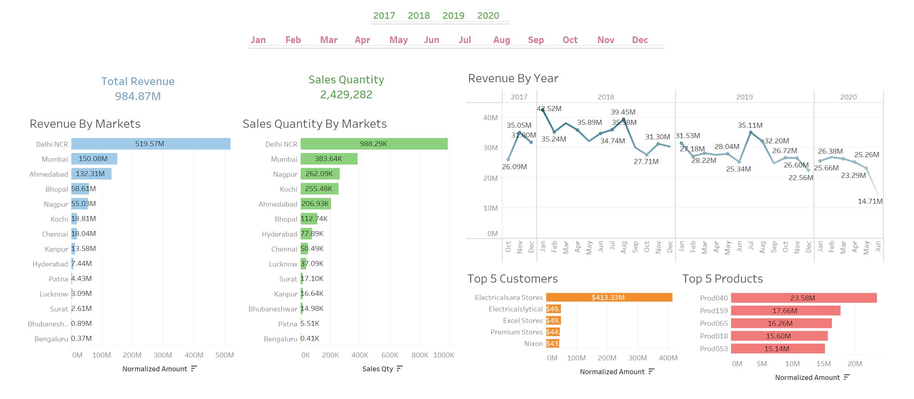
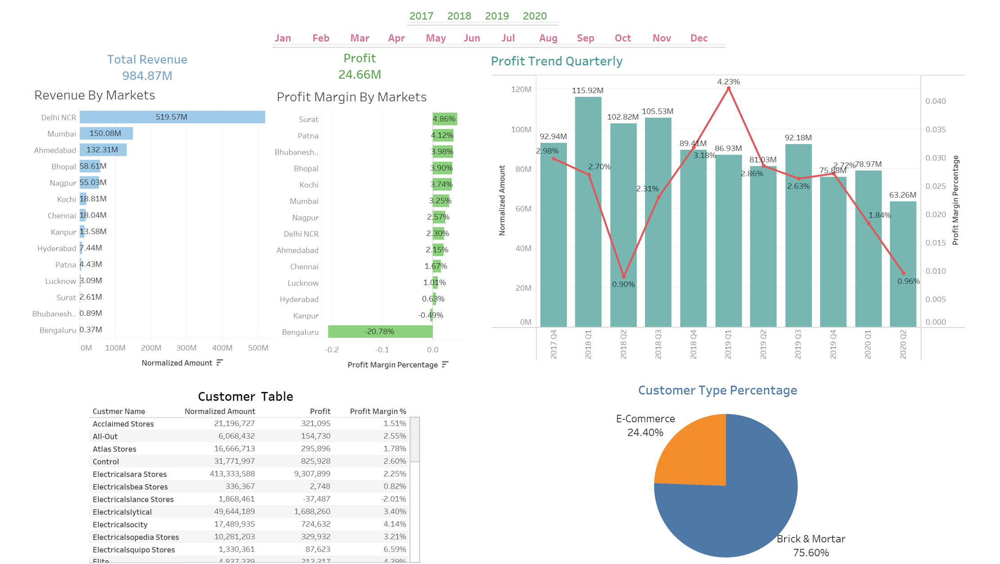

# Sales Insights Dashboard For AtliQ Hardware Company

This project's goal is to analyze sales data for the fictious company AtliQ Hardware. SQL is used for data extraction and Tableau for visualization. The dataset contains information about customers, products, orders, and transactions.

## Tools Used

Tableau: Data visualization.

SQL/MySQL: Data extraction and transformation.

Excel: Data preprocessing.

## Project Overview

The project follows a structured approach:

1. Initial Revenue Analysis Dashboard: A basic dashboard was created to analyze revenue trends across different markets.

2. Stakeholder Feedback & Revisions: Based on feedback from other students (stakeholders), modifications were made to emphasize key areas of interest.

3. Profit Analysis Dashboard: A refined dashboard was created to focus on profit trends and margins across various dimensions.

## Dashboards

**Revenue Analysis Dashboard**

The Revenue Analysis Dashboard was designed based on the initial stakeholder requirements. It provides key insights into revenue trends, sales performance, and top contributors, with all monetary values in INR.

- Revenue Trends: Visualizes revenue by market and tracks fluctuations over time.

- Sales Performance: Highlights sales quantity across different markets.

- Top Contributors: Identifies the top 5 customers and products driving revenue.

- Interactivity: Allows users to **filter data** by year or month, dynamically updating insights to reflect business performance.

**Profit Analysis Dashboard**

The Profit Analysis Dashboard is an enhanced version of the initial Revenue Analysis Dashboard, refined based on stakeholder feedback to emphasize profitability. It provides a deeper understanding of profit distribution, trends, and key contributors.

- Profit Overview: Displays total profit and profit margins across different markets.

- Trend Analysis: Tracks quarterly profit trends to identify growth patterns.

- Key Contributors: Compares profit contributions by customer type and individual customers.

- Interactivity: Allows users to filter data, offering insights tailored to a specific month or year.

## Files

RevenueAnalysisDashboard.png: Snapshot of the first revenue-focused dashboard. This was later altered to fit stakeholders needs.

ProfitAnalysisDashboard.png: Snapshot of the revised profit-focused dashboard.

## Resources:

The dataset used in this project is sourced from CodeBasic's Sales Insights Dataset. The project idea was sourced from CodeBasic's Project Pitches YouTube video.
